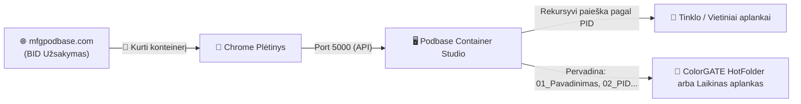

# 📖 PODBASE CONTAINER STUDIO — NAUDOJIMO INSTRUKCIJA

Šis vadovas skirtas operatoriams ir gamybos administratoriams, dirbantiems su **Podbase Container Studio** programa bei integruotu **Google Chrome** plėtiniu.

---

## 📑 TURINYS
1. [Sistemos Paskirtis ir Veikimo Principas](#1-sistemos-paskirtis-ir-veikimo-principas)
2. [Pradinis Paruošimas ir Įdiegimas](#2-pradinis-paruošimas-ir-įdiegimas)
3. [Pagrindinis Darbo Procesas (Žingsnis po žingsnio)](#3-pagrindinis-darbo-procesas-žingsnis-po-žingsnio)
4. [Stalo Vizualizacija ir Išdėstymo Taisyklės](#4-stalo-vizualizacija-ir-išdėstymo-taisyklės)
5. [Rankinis Dizainų Valdymas (Drag & Drop, Dubliavimas)](#5-rankinis-dizainų-valdymas-drag--drop-dubliavimas)
6. [Kelių Stalų Valdymas ir Atskiri Pavadinimai](#6-kelių-stalų-valdymas-ir-atskiri-pavadinimai)
7. [Išvesties Režimai: Laikinas Aplankas (10 min.) ir HotFolder](#7-išvesties-režimai-laikinas-aplankas-10-min-ir-hotfolder)
8. [Klaidų Diagnostika: Mirksintis Raudonas Lizdas](#8-klaidų-diagnostika-mirksintis-raudonas-lizdas)
9. [Užsakymų Istorija ir Greitas Pergeneravimas](#9-užsakymų-istorija-ir-greitas-pergeneravimas)
10. [Nustatymai: Modelių, Šaltinių ir Rėmų Valdymas](#10-nustatymai-modelių-šaltinių-ir-rėmų-valdymas)
11. [Dažniausiai Užduodami Klausimai (DUK / FAQ)](#11-dažniausiai-užduodami-klausimai-duk--faq)

---

## 1. SISTEMOS PASKIRTIS IR VEIKIMO PRINCIPAS

**Podbase Container Studio** automatizuoja UV spaudos paruošimo procesą:
- **Naršyklės plėtinys** nuskaitys atidarytą užsakymą iš gamybos sistemos (`mfgpodbase.com`) – nustato modelį, BID numerį ir PID dizainų sąrašą.
- **Programa** automatiškai parenka tinkamą rėmą (Jig), pagal gamybos taisykles išdėsto lizdus, rekursyviai suranda originalius spaudos failus tinkle ir suformatuoja juos ColorGATE RIP arba laikinam gamybos aplankui.



---

## 2. PRADINIS PARUOŠIMAS IR ĮDIEGIMAS

### A. Programos paleidimas
1. Atidarykite aplanką `Podbase_Naujas_Paketas`.
2. Dukart spustelėkite **`Paleisti_Programa.bat`** (arba paleiskite `Podbase_Konteineriai/Podbase_Konteineriai.exe`).
3. Programos viršuje dešinėje turi šviesti žalia lemputė: `🟢 Port 5000` (tai reiškia, kad programa pasiruošusi priimti duomenis iš naršyklės).

### B. Chrome plėtinio įdiegimas
1. Atidarykite naršyklę **Google Chrome**.
2. Adreso juostoje įveskite: `chrome://extensions/` ir paspauskite Enter.
3. Viršutiniame dešiniajame kampe įjunkite jungiklį **„Kūrėjo režimas“** (*Developer mode*).
4. Spustelėkite mygtuką **„Įkelti išskleistą“** (*Load unpacked*).
5. Pasirinkite aplanką **`Podbase_Chrome_Extension`** (esantį šalia programos).
6. Plėtinys sėkmingai įdiegtas!

---

## 3. PAGRINDINIS DARBO PROCESAS (ŽINGSNIS PO ŽINGSNIO)

1. **Atidarykite užsakymą:** Gamybos svetainėje (`mfgpodbase.com`) atidarykite norimą BID užsakymo langą (paspauskite ant BID numerio arba būsenos „Laukiama“).
2. **Paspauskite mygtuką:** Užsakymo lango apačioje arba viršuje paspauskite žalią mygtuką **`🚀 Kurti konteinerį`**.
3. **Automatinis persijungimas:** Naršyklė perduos duomenis, o programa iškils į priekį su jau sugeneruotu stalu:
   - Automatiškai parinktas gaminio modelis ir priskirtas rėmas (pvz. 2x5, 1x7 ir t.t.).
   - Įrašytas konteinerio pavadinimas (pvz. `BID-6363`).
   - Išdėstyti dizainai su miniatiūromis ir PID numeriais.
4. **Patikrinkite stalą:** Jei reikia, pakeiskite tvarką ar pridėkite trūkstamą dizainą.
5. **Generuokite:** Paspauskite didelį žalią mygtuką **`🚀 SUKURTI KONTEINERĮ`**.
6. **Rezultatas:** Failai automatiškai pervadinti ir nukopijuoti, o atitinkamas aplankas atidaromas ekrane.

---

## 4. STATO VIZUALIZACIJA IR IŠDĖSTYMO TAISYKLĖS

Programa naudoja specialią fizinio spausdinimo seką:

### 📐 Apatinė eilutė:
- **1 dizainas:** Visada stoja **apačioje kairėje** (`[01]`).
- **2 dizainai:** Naujas stoja į kairę (`[02]`), o pirmasis pasislenka į dešinę (`[01]`).
- **Palaipsnis stūmimas:** Kiekvienas naujas apatinės eilutės dizainas atsiranda kairėje, stumdamas senesnius į dešinę, kol eilutė užsipildo:
  ```
  [05]  [04]  [03]  [02]  [01]
  ```

### 📐 Viršutinė (antra) eilutė:
- Prasideda nuo 6-ojo dizaino ir pildosi **iš dešinės į kairę**:
  ```
  [  ]  [  ]  [  ]  [  ]  [06]
  [05]  [04]  [03]  [02]  [01]
  ```
- Pilnai užpildytas 10 vietų stalas (2x5):
  ```
  [10]  [09]  [08]  [07]  [06]
  [05]  [04]  [03]  [02]  [01]
  ```

---

## 5. RANKINIS DIZAINŲ VALDYMAS (DRAG & DROP, DUBLIAVIMAS)

Kiekvienas lizdas turi interaktyvius valdymo mygtukus (atsiranda užvedus pelytę):
- **➕ Dubliuoti (viršuje kairėje):** Nukopijuoja šį dizainą į artimiausią laisvą lizdą (arba sukuria naują stalą, jei esamas pilnas).
- **🗑️ Išvalyti (viršuje dešinėje):** Pašalina dizainą iš lizdo.
- **🔄 Drag & Drop (Vilkimas):**
  - Galite nutempti bet kurį lizdą į kitą vietą – lizdai susikeis vietomis.
  - Galite tiesiai iš kompiuterio ar naršyklės įmesti nuotraukas / failus – jie automatiškai užpildys laisvas vietas.
- **🔁 Mygtukas „Apversti“:** Apverčia visų stalo dizainų seką atvirkštine tvarka.
- **➕ Mygtukas „Pridėti“:** Prideda rankinį bandomąjį dizainą (`PID-1001`).

---

## 6. KELIŲ STALŲ VALDYMAS IR ATSKIRI PAVADINIMAI

Kai užsakyme yra daugiau dizainų nei telpa į vieną rėmą (pvz., 14 dizainų rėme 2x5):
1. Programa automatiškai sukuria kelis stalus: **Stalas 1 iš 2**, **Stalas 2 iš 2**.
2. Mygtukais **◀ (Ankstesnis)** ir **▶ (Kitas)** vaikštote tarp stalų.
3. **Atskiri pavadinimai kiekvienam stalui:**
   - Kiekvienas stalas turi atskirą pavadinimo laukelį (pvz., `BID-6363` pirmajam stalui ir `BID-6363_2` antrajam).
   - Galite laisvai pakeisti bet kurio stalo pavadinimą – jis bus išsaugotas būtent tam stalui.
   - Pirmasis kiekvieno stalo failas bus pavadintas pagal to stalo pavadinimą: `01_BID-6363.png`, `01_BID-6363_2.png`.

---

## 7. IŠVESTIES REŽIMAI: LAIKINAS APLANKAS (10 MIN.) IR HOTFOLDER

Priklausomai nuo modelio nustatymų, generavimas veikia dviem būdais:

### 1. 📁 Laikinas aplankas (MacBook ir kt.)
- Failai sukeliami į tvarkingą aplanką: `Desktop/Konteineriai/<StaloPavadinimas>`.
- **Jokio dubliavimosi:** Nėra jokių `(1)`, `(2)` ar perteklinių laiko žymų. Pergeneravus – aplankas švariai atnaujinamas.
- **10 min. auto-išvalymas:** Fone veikiantis laikmatis po 10 minučių automatiškai ir saugiai ištrina laikiną aplanką, kad darbalaukis neapsikrautų.

### 2. ⚡ Tiesiogiai į ColorGATE HotFolderį (iPad, Dėklai ir kt.)
- Failai akimirksniu nukopijuojami tiesiai į ColorGATE RIP stebimą katalogą (pvz. `Productionserver25/HotDir/IPAD 10.9 2022`).

---

## 8. KLAIDŲ DIAGNOSTIKA: MIRKSINTIS RAUDONAS LIZDAS

Jei generuojant bent vienas dizaino failas nerastas šaltinio aplankuose:
1. **Raudonas mirksėjimas:** Tas konkretus lizdas pradeda **intensyviai mirksėti ryškiai raudona spalva** su žyma `TRŪKSTA`.
2. **Automatinis nukreipimas:** Jei trūkstamas failas yra 2-ame ar 3-iame stale, programa automatiškai perjungia vaizdą į tą stalą.
3. **Pranešimas:** Pasirodo klaidos pranešimas su trūkstamo failo PID numeriu.
4. **Ką daryti?**
   - Patikrinkite, ar gamybos tinkle failas jau sugeneruotas.
   - Patikrinkite Nustatymuose, ar nurodytas teisingas šaltinio aplankas.
   - Įkelkite failą rankiniu būdu (Drag & Drop) arba paspauskite ant lizdo, kad sustabdytumėte mirksėjimą.

---

## 9. UŽSAKYMŲ ISTORIJA IR GREITAS PERGENERAVIMAS

Kortelėje **„📜 Generavimo Istorija“**:
- Saugoma iki 150 paskutinių atliktų generavimų su data, modeliu, stalų skaičiumi ir dizainais.
- **🔍 Paieška:** Galite greitai rasti užsakymą pagal BID numerį, modelį ar datą.
- **Mygtukas „🔄 Įkelti į redaktorių ir pergeneruoti“:** Pilnai atkuria visus stalus ir dizainus redagavimui.
- **Mygtukas „⚡ Greitas nusiuntimas į aplanką“:** Vienu paspaudimu iš naujo suformuoja failus.
- **Mygtukas „📁 Atidaryti aplanką“:** Atidaro išvesties vietą.

---

## 10. NUSTATYMAI: MODELIŲ, ŠALTINIŲ IR RĖMŲ VALDYMAS

Kortelėje **„⚙️ Nustatymai ir Tema“**:

### 📱 Modelių ir Žaliavų Nustatymai:
- **Modelio Pavadinimas:** Pavadinimas, rodomas sąraše.
- **Priskirtas Rėmas (Jig):** Pasirinkite, kokio dydžio stalas naudojamas (2x5, 1x7, 2x2 ir t.t.).
- **Išvesties Tipas:**
  - *📁 Laikinas aplankas (Išsivalo po 10 min.)*
  - *⚡ Tiesiogiai į ColorGATE HotFolderį*
- **Šaltinis (Spaudos failų aplankas):** Mygtuku **„Naršyti...“** nurodykite tinklo ar vietinį aplanką. Programa **rekursyviai ieško per visus subfolderius**.
- **Paskirtis (HotFolderis arba Aplankas):** Kelias į ColorGATE HotDir arba specifinį aplanką.
- **Alijasai / Raktažodžiai:** Raktažodžiai, pagal kuriuos naršyklės plėtinys automatiškai atpažįsta šį modelį.

### 📂 Paieškos Aplankai:
- **Brokų (Rejected) aplankas:** papildomas aplankas, kuriame taip pat ieškoma spaudos failų pagal PID visiems modeliams (kartu su poaplankiais). Pasirinkite jį mygtuku **„Pasirinkti...“** ir paspauskite **„💾 Išsaugoti nustatymus“**. Žalias užrašas reiškia, kad aplankas pasiekiamas.
- Jei tas pats PID randamas keliuose aplankuose, imamas naujausias failas.

### 📐 Rėmų (Jigs) Valdymas:
- Galite susikurti naujus rėmus, nurodydami eilučių (*Rows*) ir stulpelių (*Cols*) skaičių.

### 🎨 Temos pasirinkimas:
- Viršuje galite vienu paspaudimu perjungti tarp **☀️ Šviesios** ir **🌙 Tamsios** temos.

---

## 11. DAŽNIAUSIAI UŽDUODAMI KLAUSIMAI (DUK / FAQ)

#### ❓ Plėtinyje rodo klaidą „Plėtinio ryšio klaida: Could not establish connection...“
👉 **Sprendimas:** Įsitikinkite, kad kompiuteryje yra paleista **Podbase Container Studio** programa ir jos viršuje dešinėje šviečia `🟢 Port 5000`.

#### ❓ Kaip pakeisti, kur programa ieško MacBook failų?
👉 **Sprendimas:** Eikite į **Nustatymai** $\rightarrow$ pasirinkite MacBook modelį $\rightarrow$ ties **Šaltinis** paspauskite **„Naršyti...“** ir nurodykite naują aplanką. Paspauskite **„Išsaugoti nustatymus“**.

#### ❓ Kodėl pirmas failas vadinasi `01_BID-6363.png`, o kiti `02_PID-8528.png`?
👉 **Paaiškinimas:** ColorGATE RIP sistema automatiškai visą konteinerį pavadina pagal pirmojo įkelto failo pavadinimą. Todėl pirmasis failas pervadintas konteinerio pavadinimu, o likę išlaiko savo unikalų PID.

#### ❓ Ar saugu, kad laikinas aplankas išsivalo po 10 min.?
👉 **Paaiškinimas:** Taip. 10 minučių yra daugiau nei pakankamai laiko operatoriui paimti failus į spaudos programą. Automatinis ištrynimas apsaugo kompiuterį nuo gigabaitų perteklinių spaudos failų kaupimosi.

---
*Podbase Container Studio — Gamybos automatizavimo sprendimas.*
